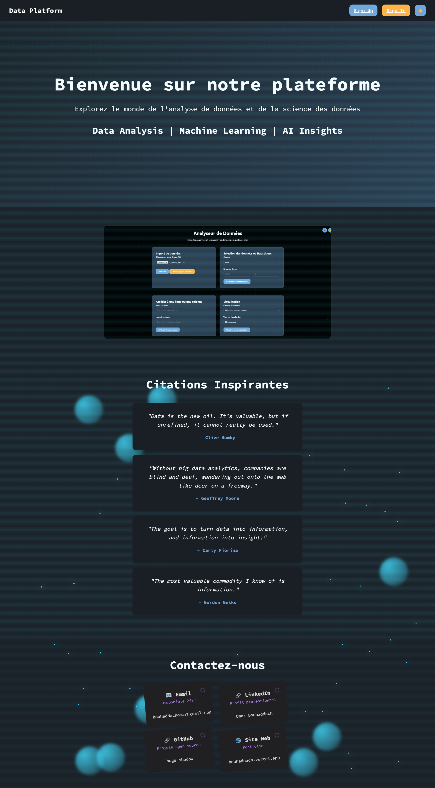
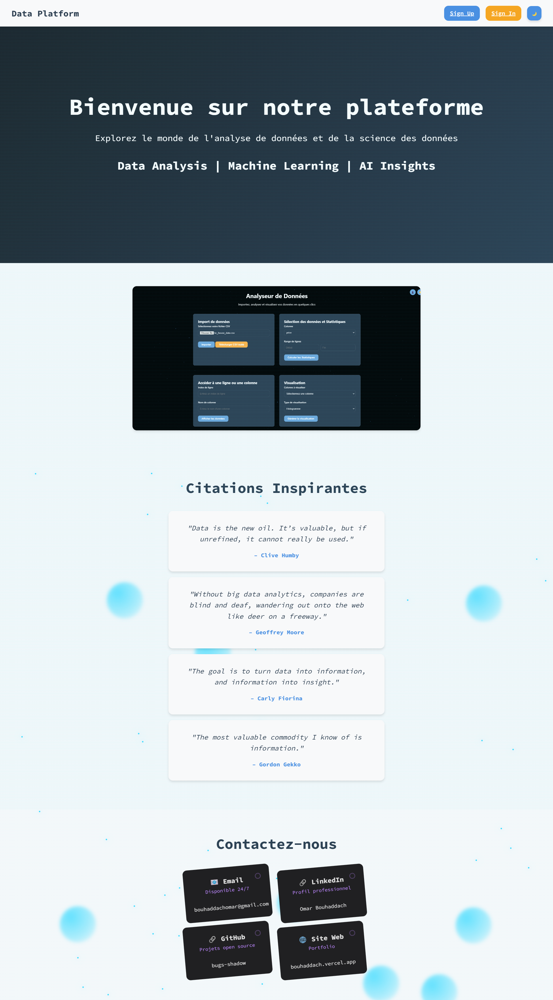

# Data Platform

**Data Platform** est une application web moderne conçue pour l'analyse et la visualisation de données. Cette plateforme intuitive permet aux utilisateurs de transformer leurs données en informations exploitables grâce à des outils d'analyse avancés et des visualisations interactives. Elle est construite avec Django, Plotly, et Three.js pour une expérience fluide et attrayante.

---

## Fonctionnalités principales

- **Import de fichiers CSV** : Chargez vos fichiers CSV pour débuter l'analyse.
- **Aperçu des données** : Consultez un aperçu sous forme de tableau des données importées.
- **Statistiques descriptives** : Accédez à des indicateurs comme la moyenne, la médiane, et l'écart-type pour chaque colonne.
- **Visualisations interactives** : Créez des graphiques dynamiques (histogrammes, boîtes à moustaches, nuages de points, etc.).
- **Filtrage des données** : Effectuez des sélections ciblées sur vos données.
- **Téléchargement des données** : Exportez les données traitées au format CSV.
- **Mode sombre/clair** : Adaptez l'interface à vos préférences visuelles.
- **Animations 3D** : Profitez d'une interface immersive grâce aux animations 3D intégrées.

---

## Captures d'écran

Découvrez la plateforme en action avec ces captures d'écran en mode sombre et en mode clair.

<div style="display: flex; justify-content: space-between;">
  
  
</div>

---

## Installation

### Prérequis

- Python 3.8 ou supérieur
- pip (gestionnaire de paquets Python)

### Étapes d'installation

1. **Cloner le dépôt** :

    ```bash
    git clone https://github.com/bugshadow/Data-platform.git
    cd data-platform
    ```

2. **Créer un environnement virtuel** :

    ```bash
    python -m venv venv
    source venv/bin/activate  # Sur Windows : venv\Scripts\activate
    ```

3. **Installer les dépendances** :

    ```bash
    pip install -r requirements.txt
    ```

4. **Configurer la base de données** :

    ```bash
    python manage.py migrate
    ```

5. **Créer un superutilisateur (optionnel)** :

    ```bash
    python manage.py createsuperuser
    ```

6. **Lancer le serveur de développement** :

    ```bash
    python manage.py runserver
    ```

7. **Accéder à l'application** : Ouvrez votre navigateur et accédez à [http://127.0.0.1:8000/](http://127.0.0.1:8000/).

## Utilisation

### Page d'accueil
La page d'accueil propose une interface conviviale avec des animations 3D en arrière-plan. Pour accéder à toutes les fonctionnalités, vous pouvez vous inscrire ou vous connecter.

### Import de données
1. Cliquez sur **"Importer un fichier CSV"**.
2. Sélectionnez un fichier CSV depuis votre ordinateur.
3. Une fois le fichier chargé, un aperçu des données sera affiché.

### Analyse des données
- **Statistiques** : Sélectionnez une colonne pour afficher des statistiques détaillées (moyenne, médiane, etc.).
- **Visualisations** : Choisissez un type de graphique (histogramme, boîte à moustaches, etc.) pour visualiser vos données.
- **Filtrage** : Sélectionnez des lignes ou des colonnes spécifiques pour une analyse ciblée.

### Téléchargement des données
Téléchargez l'ensemble des données traitées ou une sélection spécifique au format CSV.

### Mode sombre/clair
Cliquez sur l'icône 🌙 ou ☀️ pour basculer entre les thèmes sombre et clair.

---

## Technologies utilisées

### Backend
- **Django** : Framework web Python pour la logique serveur.
- **Pandas** : Bibliothèque pour la manipulation et l'analyse de données.
- **Plotly** : Bibliothèque pour la génération de visualisations interactives.

### Frontend
- **HTML/CSS/JavaScript** : Pour la structure et le style de l'interface utilisateur.
- **Three.js** : Bibliothèque JavaScript pour les animations 3D.
- **Plotly.js** : Pour les graphiques interactifs côté client.

### Base de données
- **SQLite (par défaut)** : Base de données légère pour le stockage des utilisateurs et des sessions.

---

## Structure du projet

```plaintext
data-platform/
├── analyzer/                  # Application principale
│   ├── migrations/            # Migrations de la base de données
│   ├── static/                # Fichiers statiques (CSS, JS, images)
│   ├── templates/             # Templates HTML
│   ├── views.py               # Logique des vues
│   └── ...
├── manage.py                  # Script de gestion Django
├── requirements.txt           # Dépendances Python
└── README.md                  # Documentation du projet

```


---

## Auteur

- **Omar Bouhaddach** - Développeur principal  
  - Contact : [Email](mailto:bouhaddachomar@gmail.com)  
  - GitHub : [bugs_shadow](https://github.com/bugshadow)  
  - LinkedIn : [omar-bouhaddach](https://www.linkedin.com/in/omar-bouhaddach-7420a02b4/)  

---

## Remerciements

- Merci à la communauté **Django** pour son excellent framework.
- Merci à **Plotly** pour ses outils de visualisation puissants.
- Merci à **Three.js** pour ses animations 3D impressionnantes.